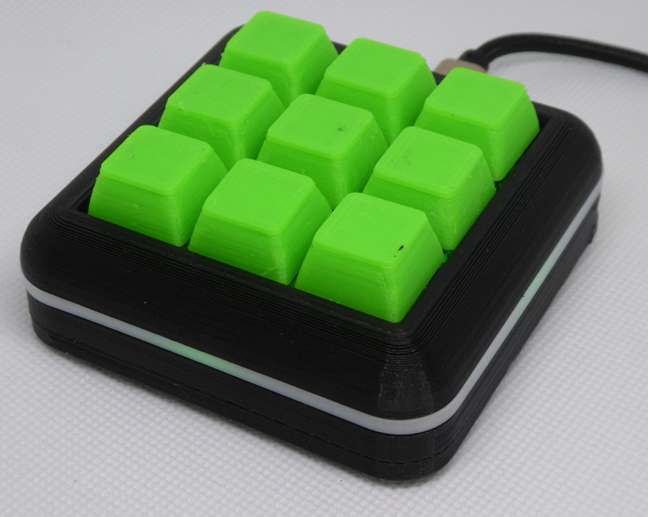

**[PW-Stick](https://github.com/seeers/PW-Stick)** is a easy to use hardware password manager
======

## Features
* Stores up to 9 user names and passwords / each up to 47 characters
* Keepass 2 (http://keepass.info/) supports the PW-Stick with a plugin
* AES Encrypted Memory
* Protected by a 4 digit pin
* Secure erase after 4 wrong pin attempts
* Optional auto lock timer
* Works as HID Keyboard

## New - Desktop version

Instruction available in "[Desktop_version](./Desktop_version)" folder.

## Usage
###### 1. Plug in the Password Stick
   * The orange LED indicates that the device is locked

###### 2. Enter your 4 digit pin to unlock the device (Default Pin is 0000)
   * A short red LED flash indicates a wrong pin attempt
   * If you enter a wrong pin 4 times, the stick will **delete all entries** while flashing blue
   * A green LED indicates that the device is unlocked an ready

###### 3. Type your Username/Password by pressing the button of the entry
   * Sequence: {USERNAME}{TAB}{PASSWORD} (optional:{ENTER})
   * Press the button for >1sec to type only the password

## Key Layout

  (TOP)
(USB Plug)

| 1 | 2 |  
| ------------- |:-------------:|
| 3 | 4 |
| 5 | 6 |
| 7 | 8 |
| 9 | 0 |
*0 is also the lock key*

## Install Keepass plugin:

* The Plugin is compiled for KeePass 2.32 (https://sourceforge.net/projects/keepass/files/KeePass%202.x/2.32/)
* [Download](https://github.com/seeers/PW-Stick/blob/master/PWStickKeepassPlugin/PWStickPlugin/bin/Release/PWStick.dll?raw=true) the plugin
* Copy the .dll plugin file into the KeePass directory (where the KeePass.exe is) or a subdirectory of it.
* Restart KeePass in order to load the new plugin.

## Plugin usage:
After the device is unlocked you can read all stored entries from the stick to Keepass by clicking Tools ==> ReadFromStick

------

A new group "Password Stick" will be created or refreshed with the entries:

------

You can send any existing username with password to a button of the stick by right clicking ==> SendToHWPW-Stick

*note that the Password Stick Group will not be automatically refreshed after adding a new entry to a button!

------

You can modify some settings of the Stick by Tools ==> Stick Settings:

* You can configure timer to lock the stick after * minutes
* You can enable/disable the {ENTER} key after the Username/Password sequence
* You can enable/disable locking your computer (WIN_Key+L) after locking the stick with button 0

## Special features
  * Username "!"  = ALT + CTRL + DEL ==> Wait 1sec. ==> types password ==> return key (for Windows login)
  * Username "$"  = WIN + R ==> Password (Command) ==> Return
  example: Username $   Password: Command   ==> if you press the button a cmd will open

## Hardware

* Atmega32u4 with Arduino Leonardo bootloader
* 16 MHz Crystal
* WS2812b RGB LED
* 10 Tactile Switches
* Some resistors and capacitors
* 3D Printed case

## Prototype

* 'Arduino' Pro Micro
* WS2812b RGB LED
* 8 mini tactile switches

**Source code / schematic:** [https://github.com/seeers/PW-Stick](https://github.com/seeers/PW-Stick)

**Released:** Mar 23, 2016

**Status:** Operational, maybe some bugs, works for me since some months.

**Licence:**  CC BY-NC-SA 3.0

## Contact

**Point of Contact:**  
* Twitter: [@seeers0](https://twitter.com/seeers0)
* E-Mail: <seeers@gmx.de>

-----
