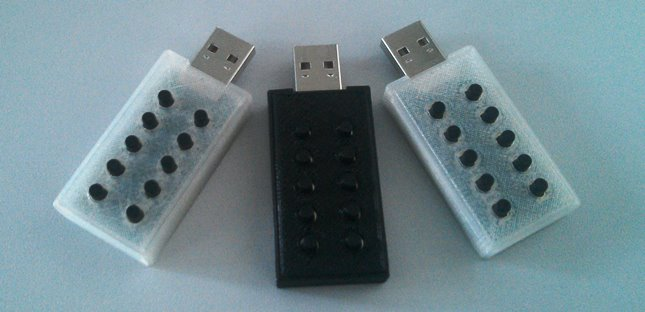
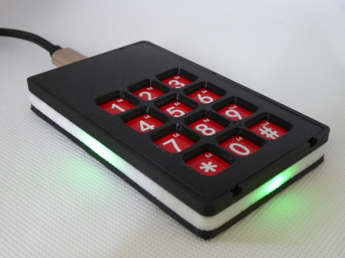

**[PW-Stick](https://github.com/seeers/PW-Stick)** is a easy to use hardware password manager
======

## Features
* Stores up to 9 user names and passwords / each up to 47 characters
* Keepass 2 (http://keepass.info/) supports the PW-Stick with a plugin
* AES Encrypted Memory
* Protected by a 4 digit pin
* Secure erase after 4 wrong pin attempts
* Optional auto lock timer
* Works as HID Keyboard

## Portable version

## Desktop version

## Instructions

See the wiki for build and use instructions.

## Notes
**Released:** 
* Stick version by Seers : Mar 23, 2016
* Desktop version by MatthGyver : Apr 07, 2019

**Status:** Operational, maybe some bugs, works for me since some months.

**Licence:**  CC BY-NC-SA 3.0

## Contact
**Point of Contact:**  
* Twitter: [@seeers0](https://twitter.com/seeers0)
* E-Mail: <seeers@gmx.de>

-----
